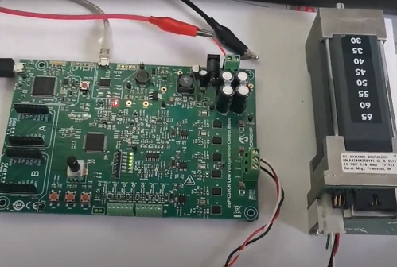
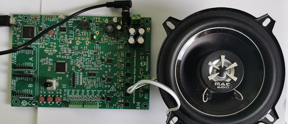
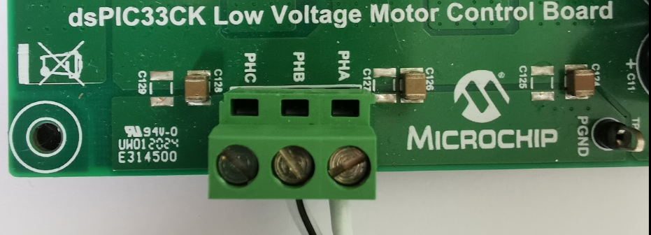

# MPLAB X Project: noisegen_FIP_dsPIC33CK_INT_LVMC

This is a sound generator demo project for [Low Voltage Motor Control (LVMC)](https://www.microchip.com/DevelopmentTools/ProductDetails/PartNO/DM330031) development board and [dsPIC33CK256MP508](https://www.microchip.com/wwwproducts/en/dsPIC33CK256MP508) microcontroller that is populated on the board. 

The demo drives a speaker or a Motor to play notes.

[Video](https://microchiptechnology-my.sharepoint.com/:v:/g/personal/mark_wendler_microchip_com/ER4R-VjUtIJHlTP9Xt5HCMYB0wU3iUwKpqfh00sCoDp8tQ?e=nzepZ7)

### Features
* Simple sine wave generator with frequency input
* Envelope generator/amplitude modulation for note playback from lookup table
* Song notes sequencing, the "player" is implemented in C

 
## Getting Started

The demo is ready to use with the [listed hardwares below](#hardware).

1. Clone or Download project to noisegen_fip_dspic33ck_lvmc.x folder.
2. [Connect Hardware](#connectors-used)
3. Open project with MPLAB X
4. Build project then program the HW
5. Press SW3 to start the noise
6. Use POT to control sound frequency and SW1 to change mode

## Create your own song

Use the noteTableGenerator excel file to generate the 16bit array. See the jinglebells.c as example.

## HW/SW Tools
### Hardware

* **LVMC dev board:** [DM330031](https://www.microchip.com/DevelopmentTools/ProductDetails/PartNO/DM330031) Low voltage motor control development board with [dsPIC33CK256MP508] (https://www.microchip.com/wwwproducts/en/dsPIC33CK256MP508) MCU populated on board
* **Motor:** 12V 10-20cm speaker
* **Programmer/Debugger:** No need. Programmer/debugger is on board (PKOB4)
* **RS232-USB converter:** No need. Converter is on board (MCP2200 or PKOB4)

### Connectors used:

* **PHA/PHB/PHC:** 
  * Speaker+ -> PHASEA (Motor P1 PIN3)
  * Speaker- -> PHASEB (Motor P1 PIN2)
* **J1/J2:** 24V Power supply
* **J13 USB:** PICkit on board 4 (PKOB4) programmer debugger
* **J6 USB-UART:** Used to connect UART to computer (Optional for run-time monitoring and parameter tuning)

 

### Software

To start the demo, only the MPLAB X IDE and XC16 compiler is required. 
If SW modification and Runtime Monitoring feature are required then all SW tools will be needed listed here:

* [MPLAB X](https://www.microchip.com/mplab/mplab-x-ide) Integrated Development Environment. 
* [XC16 Compiler:](https://www.microchip.com/mplab/compilers) Compiler for the Microchip 16bit MCUs
* [Scilab v5.5.2:](https://www.scilab.org/download/5.5.2) Scilab(Scientific Laboratory) is free and open source software for numerical computation providing a powerful computing environment for engineering and scientific applications. (Scilab 6.x is not supported yet)
* [X2C](https://x2c.lcm.at/downloads/) Code generation add-on for SCILAB, that allows the generate C-code of the model including a real-time online debugging interface for monitoring   and modifying model signal.

### Built With

* [XC16 v1.60](https://www.microchip.com/mplab/compilers) - Microchip C compiler for 16bit micros
* [X2C v6.3](https://x2c.lcm.at/) - Generate C code from Scilab/XCOS model
* [MCC v4.0.2](https://www.microchip.com/mplab/mplab-code-configurator) - Configure peripherals and generate low levev drivers

### Configuration

LVMC board is used in the default configuration. 

The LVMC board is capable to configure different signal routing modes by zero Ohm jumper resistors. For details see the [LVMC user guide](https://www.microchip.com/DevelopmentTools/ProductDetails/PartNO/DM330031). 

* **Routing:** Internal OP_AMP is used
* **UART:** J6 MCP2200 USB-UART chip is used for X2C run-time debugging 
## Peripheral settings and I/O connections: 

   Peripherals are configured by [MCC](https://microchipdeveloper.com/mcc:mccgpio) according to the LVMC board [schematics](https://www.microchip.com/DevelopmentTools/ProductDetails/PartNO/DM330031).

   If you need more details of peripheral configuration, just open MPLAB X and MCC.

### PWM and ADC

PWM is runnin at 100kHz. The PWM triggers the ADC sampling of current phases divided by 5. ADC interrupt is used to run and calculate the control loop. So control loop is 100kHz/5=20kHz.

### UART settings: 

For X2C Communicator currently UART is used. This is used to update the model parameter in runtime on the HW. The virtual scope also uses this port. 
   
* **Baud:** 115200 8N1